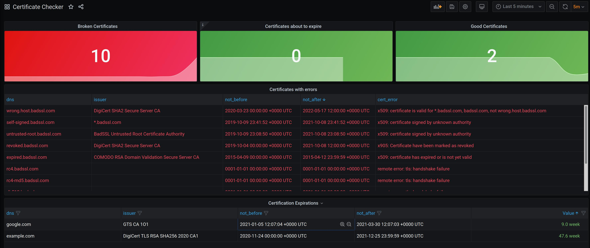

# cert-checker

[](https://actions-badge.atrox.dev/mogensen/cert-checker/goto?ref=main)
[](https://goreportcard.com/report/github.com/mogensen/cert-checker)
[](https://codecov.io/gh/mogensen/cert-checker)
[](https://app.fossa.com/projects/git%2Bgithub.com%2Fmogensen%2Fcert-checker?ref=badge_shield)

cert-checker is a certificate monitoring utility for watching tls certificates. These
checks get exposed as Prometheus metrics to be viewed on a dashboard, or _soft_
alert cluster operators.

This tool is heavily inspired by the awesome [version-checker by jetstack](https://github.com/jetstack/version-checker/).

## Supported Certificate Errors

cert-checker supports the following types of certificate errors (and possible more):

- Expired certificates
- Wrong host
- Bad root certificates
- Revoked certificate
- Cipher suites not allowed
    * dh480
    * dh512
    * null
    * rc4

---

## Installation

cert-checker can be installed as a standalone static binary from the release page

[latest release](https://github.com/mogensen/cert-checker/releases/latest/)

Create a config file like the below example: 

`config.yaml`: 

```yaml
loglevel: debug
intervalminutes: 10
certificates:
    - dns: google.com
    - dns: expired.badssl.com
```

### Run in Docker

You can use the published docker image like this:

First create a config file as above.

```bash
# Start docker container (mounting the config file may be different on OSX and Windows)
docker run -p 8080:8080 -v ${PWD}/config.yaml:/app/config.yaml mogensen/cert-checker:latest
# Now open browser at http://localhost:8080/metrics
```

See released docker images on [DockerHub](https://hub.docker.com/r/mogensen/cert-checker)

### In Kubernetes as static manifests 

cert-checker can be installed as static manifests:

```sh
$ kubectl apply -k ./deploy/yaml
```

Remember to edit the configmap with the actual domains you want to monitor.. 

### Helm

cert-checker can be installed as as helm release:

```bash
$ kubectl create namespace cert-checker
$ helm install cert-checker deploy/charts/cert-checker --namespace cert-checker
```

Depending on your setup, you may need to modify the `ServiceMonitor` to get Prometheus to scrape it in a particular namespace.
See [this](https://github.com/prometheus-community/helm-charts/tree/main/charts/kube-prometheus-stack#prometheusioscrape).

You may also need to add additional labels to the `ServiceMonitor`.
If you have installed the `prometheus-community/kube-prometheus-stack` with the name of `prometheus` the following should work:

```bash
$ helm upgrade cert-checker deploy/charts/cert-checker \
    --namespace cert-checker            \
    --set=grafanaDashboard.enabled=true \
    --set=serviceMonitor.enabled=true   \
    --set=serviceMonitor.additionalLabels.release=prometheus
```

### Kustomize

cert-checker can be installed using [kustomize](https://kustomize.io/):

Create a `kustomization.yaml` file:
```yaml
apiVersion: kustomize.config.k8s.io/v1beta1
kind: Kustomization
namespace: cert-checker
resources:
- github.com/mogensen/cert-checker/deploy/yaml
# optionally pin to a specific git tag
# - github.com/mogensen/cert-checker/deploy/yaml?ref=cert-checker-0.0.1

# override confimap with your required settings
patchesStrategicMerge:
- |-
    apiVersion: v1
    kind: ConfigMap
    metadata:
      name: cert-checker
      namespace: cert-checker
    data:
      config.yaml: |
        loglevel: info
        intervalminutes: 60
        certificates:
            - dns: my-very-own-domain.com
```
Use the `kustomization.yaml` file to preview and deploy cert-checker:
```bash
$ kustomize build kustomization.yaml | less # preview yaml manifests
$ kustomize build kustomization.yaml | kubectl apply --dry-run=client -f - # dry-run apply manifests
$ kustomize build kustomization.yaml | kubectl apply -f - # deploy manifests
```

## Metrics

By default, cert-checker will expose the version information as Prometheus
metrics on `0.0.0.0:8080/metrics`.

### Grafana Dashboard

A Grafana dashboard is also included in this repository.
It is located in the deployment folder: `deploy/yaml/grafana-dashboard-cm.yaml`


<center></center>
<p align="center">
  <b>Grafana Dashboard</b><br>
</p>

The dashboard shows the following

 - Number of Broken Certificates
 - Number of Certificates about to expire
 - Number of Good Certificates
 - A list with Certificates with errors
 - A list of Certificates Expirations for valid certificates

---

## Options

By default, without the flag `-c, --config`, cert-checker will
use a config file located next to the binary named `config.yaml`.

This is currently the only flag / option available. 

```bash
$ cert-checker -h
Certificate monitoring utility for watching tls certificates and reporting the result as metrics.

Usage:
  version-checker [flags]

Flags:
  -c, --config string   config file (default is config.yaml) (default "config.yaml")
  -h, --help            help for version-checker
```

---

## Development

Test the full setup in Kubernetes with Prometheus and Grafana dashboards:

```bash
# First create a new kind cluster locally, and install prometheus
make dev.kind.create
# Build a docker image, load it into kind and deploy cert-checker and promeheus/grafana stuff
make image dev.kind.install
```

Access the local infrastructure here:

| System        | URL                                                                                                        |
| ------------- |------------------------------------------------------------------------------------------------------------|
| Prometheus    | http://prometheus.localtest.me/graph?g0.expr=cert_checker_is_valid&g0.tab=1&g0.stacked=0&g0.range_input=1h | 
| Grafana       | http://grafana.localtest.me/d/cert-checker/certificate-checker                                             | 

